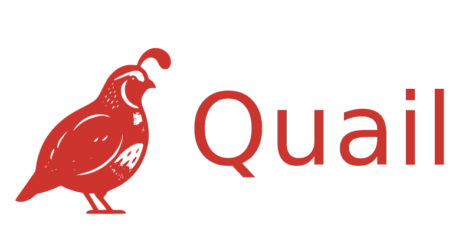

<div align="center">
  

  <strong>A Rails-first GraphQL library with a declarative, <a href="https://github.com/okuramasafumi/alba">Alba</a>-inspired DSL built on top of <a href="https://github.com/rmosolgo/graphql-ruby">graphql-ruby</a>.</strong>
</div>

> ⚠️ **This gem is under active development and has not been published to RubyGems. Please do not use in production.**

## Installation

Add Quail to your Gemfile:

```Gemfile
gem "quail", git: "https://github.com/taywils/quail.git", branch: "main"
```

## Quick Start

```bash
rails generate quail:install
```

## Documentation

📖 **Full documentation:** [Quail Docs](https://taywils.github.io/quail)

The docs site covers the resource DSL, mutations, queries, subscriptions, custom types, authentication wiring, and more.

## Contributing

Bug reports and pull requests are welcome on GitHub at <https://github.com/taywils/quail>.

## License

Released under the [MIT License](./LICENSE.txt).
